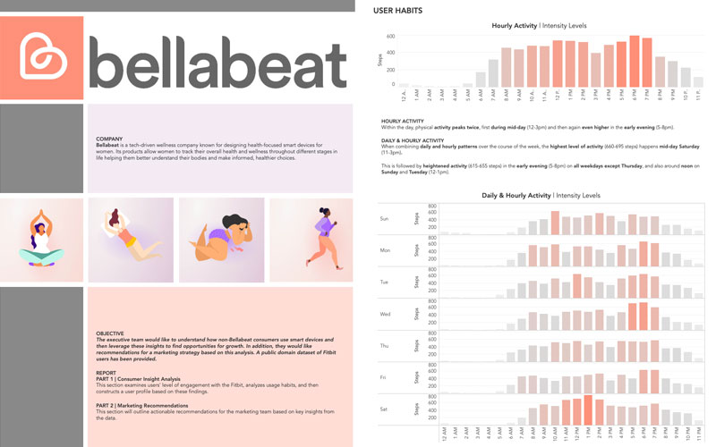

# Introduction
For many companies, looking for new growth opportunities can be a challenge after having established their initial customer base. One approach to uncovering new possibilities is to mine customer data of comparable companies in the same space.

**[Bellabeat](https://bellabeat.com/),** a fast-growing wellness tech company known for designing health-focused wearables for women, is now looking to expand their existing user base.

To better understand consumers who overlap with Bellabeat's target audience, I analyze a dataset of Fitbit users, surface insights on *user engagement* and *user habits*, and then develop a *user profile* based on these findings. Using a data-driven approach, I then recommend concrete steps as part of a *marketing strategy* to help Bellabeat grow its customer base. This repo contains a collection of files supporting this analysis.

I'll use **SQL** to validate, process, and analyze the data. And, for ease of documentation, I'll use the **Google BigQuery API** to run queries and access data from within this **Jupyter Notebook**. In addition, I'll use **Tableau** to create the data visualizations shown in this notebook, and for a separate, stand-alone visualization-driven presentation.

## ANALYSIS 📊

- **[Full Analysis with Executive Summary](https://nbviewer.org/github/phlln/bellabeat-analysis/blob/main/notebooks/bellabeat_consumer_insight_analysis.ipynb?flush_cache=True) (Jupyter Notebook & BigQuery)**
- [**Presentation**](https://public.tableau.com/app/profile/phil.lin/viz/BellabeatAnalysis_16486095004470/STORY) **(Tableau)**

## DATA 🗃

The dataset is a collection of personal tracking data submitted by Fitbit users who responded to a distributed survey via Amazon Mechanical Turk. 

33 Fitbit users consented to providing [data](https://www.kaggle.com/datasets/arashnic/fitbit) on physical activity, sleep, heart rate, and weight for the period 03.12.20166 to 05.12.2016. The users’ privacy has been protected by only referring to individuals via randomly generated ID numbers. 

The data is in the public domain (CC0 1.0 Universal Public Domain) and was first accessed via  Kaggle (uploaded by user MÖBIUS), but the data originates from Zenodo, an open access research data repository developed as part of the European OpenAIRE program and maintained by CERN (European Organization for Nuclear Research). The original dataset on Zenodo can be found [here](https://zenodo.org/record/53894#.Yn1gHhPMJqv).

## Requirements
- [Python 3.8.6](https://www.python.org/downloads/release/python-386/)
- [Jupyter Notebook](http://jupyter.org/)

## Dependencies
- [pandas](https://pandas.pydata.org/)
- [pandas_gbq](https://pandas-gbq.readthedocs.io/en/latest/)
- [google-cloud-bigquery](https://googleapis.dev/python/bigquery/latest/changelog.html)

## License
- [Attribution-NonCommercial-ShareAlike 4.0 International (CC BY-NC-SA 4.0)](https://creativecommons.org/licenses/by-nc-sa/4.0/)
